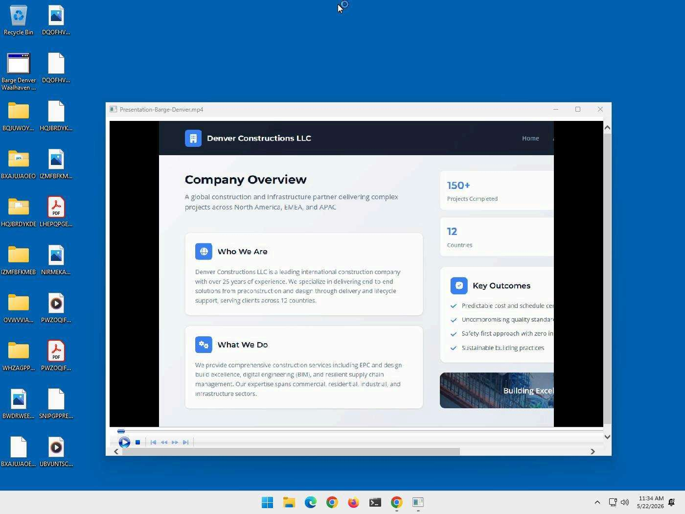

# 🔬 XWorm HTA Loader: Campaign Analysis & Forensic Threat Intelligence

[](../../)
[](../../)
[](../../)
[](LICENSE)

An in-depth, forensic investigation into the **XWorm HTA Loader** campaign discovered in May 2026. This campaign leverages highly obfuscated HTML Application (`.hta`) files, dual-stage PowerShell callbacks, WMI-based process hijacking to bypass EDR hierarchy, and custom VBS scripts to distribute and execute the **XWorm RAT** (Remote Access Trojan).

---

## ⚡ Campaign Architecture & Execution Flow

```
User Double-clicks HTA
  │
  ├──► Spawn mshta.exe (PID: 7104) ───► Drops: C:\Users\user\AppData\Local\started.flag
  │                                   └──► Drops: C:\Users\user\AppData\Local\Telegram_Private_Call_Session.vbs
  │
  ├──► Spawn powershell.exe (PID: 4312) ──► Outbound C2 Callback: 193.23.202.187:8022
  │                                          ├──► Download stage-2: lightlife.ps1
  │                                          └──► Download decoy: Denver.mp4
  │
  └──► EDR Evasion: Spawn WMIC.exe (PID: 6776) ──► WmiPrvSE.exe ──► Spawn wscript.exe (PID: 6840)
                                                                       │
                                                                       └──► Executes VBS Loader (XWorm RAT Active)
```

For a comprehensive phase-by-phase chronological breakdown, view the [Timeline Documentation](timeline.md).

---

## 📊 Malware Technical Specifications

### **1. Target File Metadata**
* **File Name**: `Barge Denver Waalhaven - Work presentation.hta`
* **File Type**: HTML Document (HTML Application / ASCII Text with extremely long lines)
* **File Size**: `9.38 KB`
* **Entropy**: `5.007`
* **SHA256**: `dd9468a3951d81514f8ae79205e0c96994733025048f1b4e26d482a861120b11`
* **SHA1**: `c84890135589930a58d1463c430dfb4b3cfaa494`
* **MD5**: `88ffae61c62e01dac1825b02e054a5cc`

### **2. Anti-Analysis & Detection Summary**
- **VirusTotal Detection Rate**: `84 / 100` (Highly Malicious)
- **Primary Sandboxes Evaluated**: CAPE Sandbox, Zenbox
- **Evasion Tactics**: 
  - Execution of processes via WMI to split process creation trees (bypassing simple EDR child-monitoring rules).
  - Data obfuscation utilizing base64-encoded, multiline PowerShell strings.
  - Interactive window change detection and evasive execution delays (`WSH` timers and long sleep loops > 3 minutes).

---

## 📷 Analysis & Sandbox Reports

### **1. VirusTotal Threat Graph**
The VT Graph illustrates the relations between the initial HTA file, the German IP address node (`193.23.202.187`), downloaded components, and the final dynamically compiled assemblies.


### **2. Zenbox Sandbox Verdict**
The Zenbox execution report shows a critical warning level of `84/100`, confirming registry manipulation, process injection, and active Trojan behavior.


### **3. CAPE Sandbox Execution**
The CAPE Sandbox trace captures the runtime behavior of the malware inside the Windows 11 isolated analysis host, demonstrating file writes in Local AppData and active callback attempts.


---

## 📂 Repository Contents

This repository serves as a complete threat intelligence resource for security operations teams:

* [WARNING.md](WARNING.md): **Critical Safety Disclaimers** and network containment guidelines for threat analysts.
* [timeline.md](timeline.md): **Chronological Infection Chain** outlining process IDs, evasion techniques, and dropped modules.
* [cleanup-guide.md](cleanup-guide.md): **Incident Response & Remediation Guide** for removing the loader and persistent artifacts from infected machines.
* [LICENSE](LICENSE): MIT License guidelines.
* [iocs/iocs.csv](iocs/iocs.csv): The raw **Indicator of Compromise (IOC) Database** containing all 81 related hashes, C2 domains, IP addresses, and file indicators.

---

## 🛡️ Quick-Access Indicators of Compromise (IOCs)

A selection of critical indicators from our complete [IOC Database](iocs/iocs.csv):

| Type | Indicator / Hash | Description / Threat Area |
|---|---|---|
| **SHA256** | `dd9468a3951d81514f8ae79205e0c96994733025048f1b4e26d482a861120b11` | Primary HTA Loader Script |
| **SHA256** | `9DF997476E96979E19BD6EDA529B62DD9F1FE350DFD2E1C84F86D5DF48CE8871` | Dropped VBS script `Telegram_Private_Call_Session.vbs` |
| **SHA256** | `ECBC89CD37A037342E740F9E0E0633A70180A2279B0157C9A823FCE729F4BD77` | Host Execution Flag `started.flag` |
| **IP Address** | `193.23.202.187` | Stage-2 Distribution C2 Server (Germany) |
| **IP Address** | `193.161.193.99` | Portmap.io Tunnel Backend Interface |
| **Domain** | `dayzcheatcheck.online` | Active XWorm RAT C2 Communication |
| **Domain** | `jjjjjjjujjj-55237.portmap.io` | Portmap.io Redirection DNS |
| **URL** | `http://193.23.202.187:8022/Files/lightlife.ps1` | PowerShell stage-2 payload link |
| **URL** | `http://193.23.202.187:8022/Files/Denver.mp4` | Obfuscated decoy / payload component |

For the full catalog of all 81 IOCs, please consult [iocs/iocs.csv](iocs/iocs.csv).
