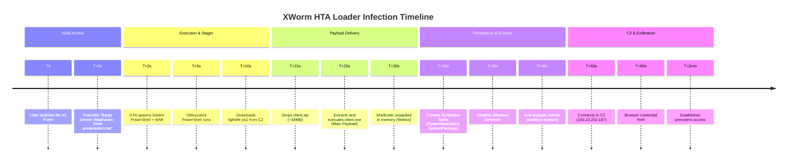
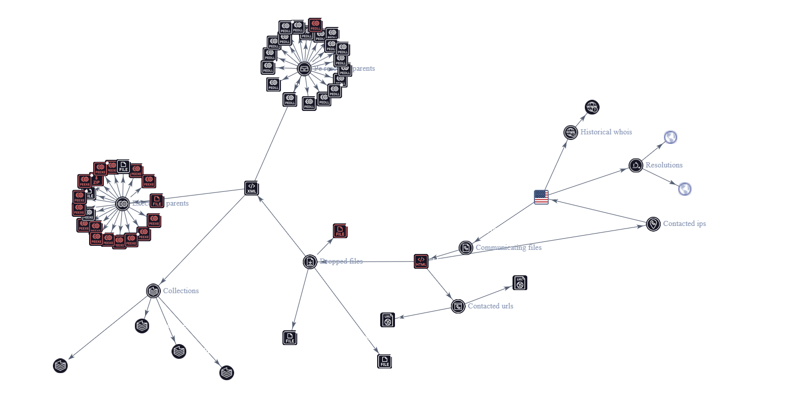

# Malware Analysis Report: Barge Denver Waalhaven HTA Dropper

**Report ID**: MAL-2026-0522-HTA-XWORM  
**Author**: Zunaid Hasan  
**Date**: May 23, 2026  
**Version**: 1.0

---

## Executive Summary

This is a **sophisticated multi-stage malware loader** belonging to the **XWorm / WinosStager** family. The malicious file was delivered via Fiverr as a fake "website presentation" (`Barge Denver Waalhaven - Work presentation.hta`).

The malware uses advanced techniques including heavy obfuscation, living-off-the-land binaries (PowerShell, WMI, WScript, curl), anti-analysis, fileless execution, and credential theft capabilities. Once executed, it establishes strong persistence and communicates with a C2 server to download the main payload.

**Threat Level**: **High**  
**Delivery Method**: Social engineering on freelance platforms

---

## File Information

- **File Name**: `Barge Denver Waalhaven - Work presentation.hta`
- **File Type**: HTML Application (HTA)
- **Size**: 9.38 KB (9609 bytes)
- **SHA256**: `dd9468a3951d81514f8ae79205e0c96994733025048f1b4e26d482a861120b11`
- **MD5**: `88ffae61c62e01dac1825b02e054a5cc`
- **VirusTotal Detection**: **84/100** (Malicious)

---

## Infection Timeline

---

## VirusTotal Relations Graph

**Interactive Version**: [View Full Graph on VirusTotal](https://www.virustotal.com/graph/g9b5a0c7176644eebaa46b58d40be25bb3f633a28f07943a186912af1373c25cf)

---

## Detailed Infection Chain

1. **Initial Access** — User executes the disguised HTA file.
2. **Stage 1** — HTA spawns hidden PowerShell and WMI processes.
3. **Stage 2** — Obfuscated PowerShell downloads stager scripts (`lightlife.ps1`, `rabbit.vbs`).
4. **Stage 3** — Downloads and extracts `client.zip` → executes main payload `client.exe`.
5. **Stage 4** — Persistence setup, defense evasion, and C2 communication.

---

## MITRE ATT&CK Mapping

- **Execution**: T1059.001 (PowerShell), T1047 (WMI)
- **Persistence**: T1053 (Scheduled Task), T1547 (Boot/Logon Autostart)
- **Defense Evasion**: T1027 (Obfuscation), T1562 (Impair Defenses), T1564 (Hide Artifacts)
- **Discovery**: System & Hardware Fingerprinting
- **Credential Access**: T1555 (Credentials from Password Stores)
- **Command & Control**: T1071 (Application Layer Protocol)

---

## Key Indicators of Compromise (IOCs)

See [`iocs/iocs.csv`](iocs/iocs.csv) for the complete list.

**Highlights**:
- **C2 IP**: `193.23.202.187`
- **Malicious Paths**: `AppData\Local\Main\`, `AppData\Local\Demp\`, `AppData\Local\Flag\`
- **Scheduled Tasks**: `SystemAssurance`, `SystemPackage`

---

## Cleanup Guide

Refer to [`cleanup-guide.md`](cleanup-guide.md) for detailed removal instructions.

**Quick Steps**:
- Delete suspicious scheduled tasks
- Remove malicious folders in `AppData\Local`
- Run full antivirus scans
- Change passwords from a clean device

---

## Prevention Recommendations

- Never open unsolicited `.hta`, `.ps1`, or `.vbs` files from clients.
- Always analyze attachments using VirusTotal or sandbox tools first.
- Enable Windows Attack Surface Reduction (ASR) rules.

---

## Repository Contents

- `full_malware_analysis_report.md` — Detailed report
- `cleanup-guide.md` — Step-by-step removal guide
- `timeline.md` — Infection timeline
- `iocs/iocs.csv` — Complete Indicators of Compromise
- `screenshots/` — Analysis screenshots

---

## Legal & Safety Notice

**This repository is for educational and defensive cybersecurity purposes only.**

- No live malware samples are included.
- Do not attempt to download or execute any referenced files.

See [`WARNING.md`](WARNING.md) and [`LICENSE`](LICENSE) for more details.

---

*Report shared to raise awareness about malware campaigns targeting freelancers on Fiverr and similar platforms.*

---

**Feedback and contributions are welcome!**  
Feel free to open an issue if you have additional information about this campaign.

---
