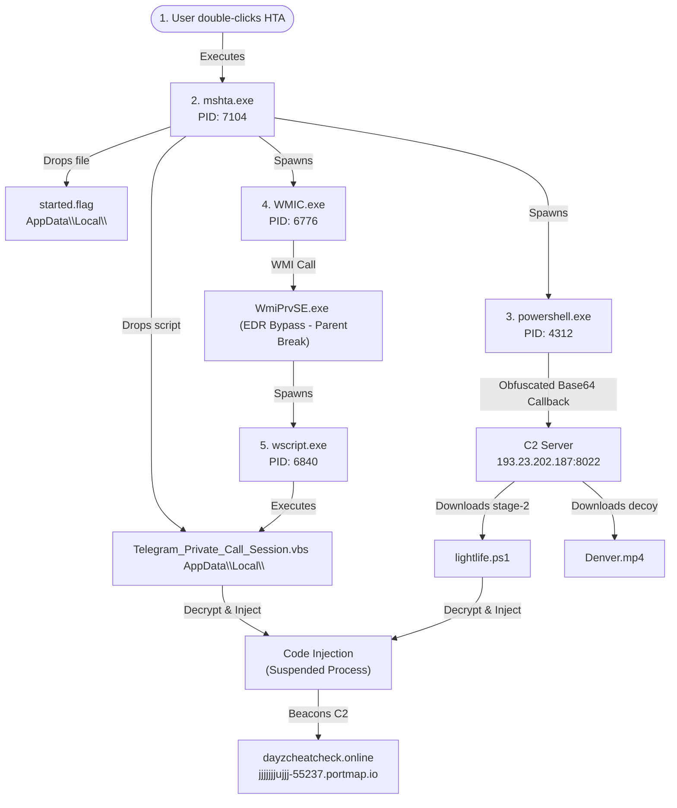

# 📅 Infection and Execution Timeline

This document maps out the precise, step-by-step chronological execution of the XWorm HTA Loader campaign. The timeline has been reconstructed from VirusTotal behavior reports, sandbox execution graphs, and forensic artifact analysis.

## 🗺️ Visual Infection Flow

The following flowchart illustrates the sequence of execution, highlighting process spawning, host writes, network callbacks, and EDR evasion techniques (WMI process tree breakage).

---

## 🕒 Chronological Step-by-Step Analysis

### **Step 1: Initial Execution (User Action)**
- **Event**: The user executes the malicious file `Barge Denver Waalhaven - Work presentation.hta` (SHA256: `dd9468a3951d81514f8ae79205e0c96994733025048f1b4e26d482a861120b11`).
- **Mechanism**: Spawns the Windows utility `mshta.exe` (PID: 7104) under the user's parent shell (usually `explorer.exe`).
- **Decoy Context**: The HTA masquerades as a legitimate Presentation (under the title `<title>Presentation-Barge-Denver.mp4</title>`), utilizing HTML elements to convince the victim they are launching a multimedia video file or Clipchamp editing project.

### **Step 2: Dropping Persistent Host Artifacts**
- **Event**: The HTA loader drops core files on the system to prepare for stage-2 and persist.
- **Dropped Files**:
  1. `C:\Users\user\AppData\Local\started.flag` (SHA256: `ECBC89CD37A037342E740F9E0E0633A70180A2279B0157C9A823FCE729F4BD77`) - Used to flag that the infection has initiated.
  2. `C:\Users\user\AppData\Local\Telegram_Private_Call_Session.vbs` (SHA256: `9DF997476E96979E19BD6EDA529B62DD9F1FE350DFD2E1C84F86D5DF48CE8871`) - A highly malicious VBS script designed to coordinate persistence and execute the final payload.

### **Step 3: Staged Network Payload Retrieval**
- **Event**: Spawning of PowerShell to retrieve the actual payload modules from the C2 distribution server.
- **Action**: `mshta.exe` launches `powershell.exe` (PID: 4312) with a long, base64-encoded command line option.
- **Connection**: PowerShell initiates an outbound HTTP connection to a German IP address `193.23.202.187:8022`.
- **Downloads**:
  - `http://193.23.202.187:8022/Files/lightlife.ps1?token=3b0b6882dca0d5ebe4d23e7cb13863dd554112ad0d2d9c14ba522f3400a4e290` -> Contains the secondary PowerShell loader script.
  - `http://193.23.202.187:8022/Files/Denver.mp4?token=3b0b6882dca0d5ebe4d23e7cb13863dd554112ad0d2d9c14ba522f3400a4e290` -> The decoy media file or obfuscated shellcode segment.

### **Step 4: EDR Evasion & WMI Process Spawning**
- **Event**: Spawning the script executor evasively to break process tracking.
- **Action**: `mshta.exe` launches `WMIC.exe` (PID: 6776) to call Windows Management Instrumentation (WMI).
- **Mechanism**: The WMI service `WmiPrvSE.exe` receives the request and spawns `wscript.exe` (PID: 6840) to execute `Telegram_Private_Call_Session.vbs`.
- **Evasion Impact**: EDR products tracking process hierarchy will see `wscript.exe` spawned by `WmiPrvSE.exe` (a legitimate Windows service) rather than `mshta.exe`. This effectively breaks the chain of custody in endpoint detection logs.

### **Step 5: Persistence Activation & Payload Injection**
- **Event**: The VBS script executes, querying COM interfaces to bypass local security controls and establishing registry/startup folder persistence.
- **Action**: `lightlife.ps1` runs to assemble and decrypt the final payload. It spawns a legitimate system process in a suspended state (e.g., code cave or DLL side-loading) and injects the XWorm RAT payload executable into memory.

### **Step 6: C2 Beaconing (Malware Active)**
- **Event**: The XWorm RAT payload executes from memory and initiates dynamic beaconing to its command-and-control server.
- **End-Stage Network Traffic**:
  - Outbound DNS lookups for `dayzcheatcheck.online` (resolving via Cloudflare CDN proxy) or dynamic DNS tunnel `jjjjjjjujjj-55237.portmap.io` pointing to Portmap.io's redirection backend.
  - The Trojan is now fully active, allowing threat actors complete remote access, keystroke logging, credential harvesting, and additional payload deployment.
